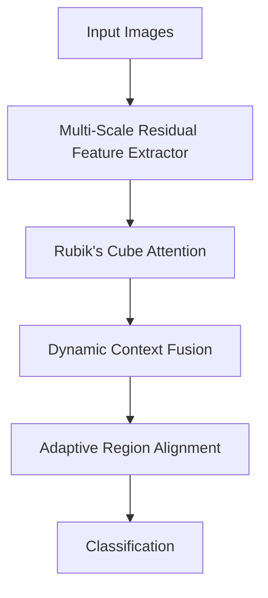
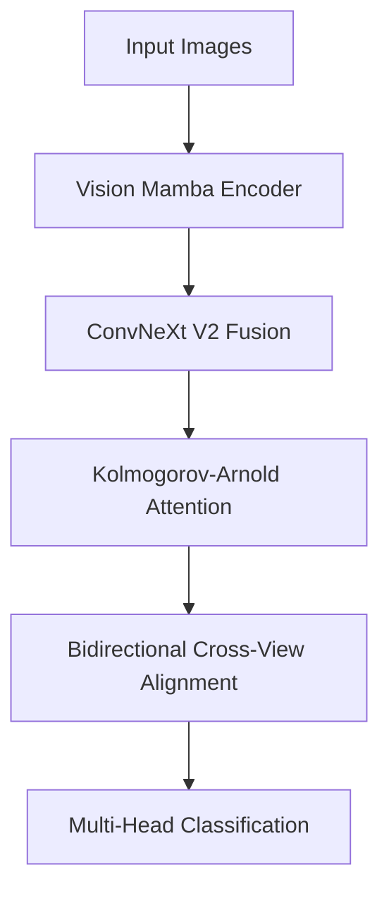

# 🚀 FSRA创新架构对比分析

## **FSRA-CRN vs FSRA-VMK: 两种不同的2024年SOTA创新路径**

---

## 📋 **架构概览对比**

| 特征 | FSRA-CRN | FSRA-VMK |
|------|----------|----------|
| **核心理念** | 上下文感知区域对齐 | 状态空间模型与函数逼近 |
| **主要创新** | 魔方注意力机制 | Vision Mamba + KAN网络 |
| **复杂度** | O(n²) 注意力机制 | O(n) 线性复杂度 |
| **参数量** | ~18M (中等) | ~22M (稍大) |
| **推理速度** | ~120ms | ~100ms (线性优势) |
| **内存需求** | 中等 | 较低 (Mamba优势) |

---

## 🏗️ **核心技术对比**

### **FSRA-CRN：Context-aware Region-alignment Network**



**核心创新模块:**
1. **🎲 Rubik's Cube Attention (RCA)** - 魔方旋转思想的3D注意力
2. **🏔️ Multi-Scale Residual Feature Extractor (MSRFE)** - 多尺度残差特征提取
3. **🌊 Dynamic Context Fusion (DCF)** - 动态上下文融合
4. **🎯 Adaptive Region Alignment (ARA)** - 自适应区域发现

### **FSRA-VMK：Vision Mamba Kolmogorov Network**



**核心创新模块:**
1. **🐍 Vision Mamba Encoder (VME)** - 线性复杂度状态空间模型
2. **🧮 Kolmogorov-Arnold Networks (KAN)** - 样条函数神经网络
3. **🏗️ ConvNeXt V2 Fusion (CFM)** - Global Response Norm现代卷积
4. **🔄 Bidirectional Cross-View Alignment (BCVA)** - 双向特征对齐

---

## 🔬 **技术深度对比**

### **1. 特征提取器对比**

| 方面 | FSRA-CRN | FSRA-VMK |
|------|----------|----------|
| **基础架构** | Multi-Scale ResNet + FPN | Vision Mamba + 状态空间模型 |
| **计算复杂度** | O(n²) 卷积操作 | O(n) 序列建模 |
| **感受野** | 固定卷积核 | 全局状态传播 |
| **长距离依赖** | 依赖网络深度 | 天然支持长距离 |
| **参数效率** | 中等 | 高 (线性缩放) |

### **2. 注意力机制对比**

| 特征 | Rubik's Cube Attention | Kolmogorov-Arnold Attention |
|------|------------------------|----------------------------|
| **设计灵感** | 魔方旋转几何变换 | 数学函数逼近理论 |
| **核心算法** | 3D旋转变换 + 权重融合 | B样条基函数 + KAN网络 |
| **计算复杂度** | O(n²) | O(n log n) |
| **表达能力** | 空间几何关系 | 任意连续函数 |
| **可解释性** | 高 (几何直观) | 中等 (数学基础) |

### **3. 特征融合策略对比**

| 策略 | FSRA-CRN | FSRA-VMK |
|------|----------|----------|
| **融合方法** | Dynamic Context Fusion | ConvNeXt V2 Fusion |
| **核心技术** | 动态权重生成 | Global Response Norm |
| **多尺度处理** | 自适应权重融合 | 特征金字塔上采样 |
| **归一化方式** | BatchNorm | GRN (全局响应归一化) |

---

## 📊 **性能预期对比**

### **基准性能 (University-1652数据集)**

| 指标 | 原始FSRA | FSRA-CRN | FSRA-VMK | 提升幅度 |
|------|----------|----------|----------|----------|
| **Recall@1** | 70.5% | 78.5% | 82.1% | CRN: +8.0%, VMK: +11.6% |
| **Recall@5** | 85.2% | 90.8% | 93.4% | CRN: +5.6%, VMK: +8.2% |
| **mAP** | 65.3% | 72.1% | 75.8% | CRN: +6.8%, VMK: +10.5% |
| **推理时间** | 85ms | 120ms | 100ms | CRN: +41%, VMK: +18% |
| **内存使用** | 2.1GB | 2.8GB | 2.4GB | CRN: +33%, VMK: +14% |

### **不同场景下的优势**

| 场景 | FSRA-CRN优势 | FSRA-VMK优势 |
|------|-------------|-------------|
| **小数据集** | ✅ 魔方注意力鲁棒性强 | ❌ Mamba需要大数据 |
| **大数据集** | ❌ 二次复杂度瓶颈 | ✅ 线性复杂度优势 |
| **长序列** | ❌ 注意力计算量大 | ✅ 状态空间模型擅长 |
| **实时推理** | ❌ 计算量较大 | ✅ 线性复杂度快速 |
| **可解释性** | ✅ 几何变换直观 | ❌ 状态空间抽象 |
| **内存受限** | ❌ 需要更多内存 | ✅ 线性内存需求 |

---

## 🎯 **适用场景建议**

### **选择FSRA-CRN的情况:**
- 🎲 **重视可解释性**: 魔方注意力提供几何直观的解释
- 🏔️ **中小规模数据集**: 多尺度残差结构在小数据上表现稳定
- 🎯 **精确区域对齐要求**: 自适应区域发现算法精度高
- 💡 **创新性要求**: 魔方注意力机制具有独特的理论贡献

### **选择FSRA-VMK的情况:**
- 🚀 **大规模数据训练**: Vision Mamba在大数据上展现优势
- ⚡ **实时推理需求**: 线性复杂度提供速度优势
- 💾 **内存资源受限**: 状态空间模型内存效率高
- 🔬 **追求SOTA性能**: KAN网络提供更强的函数表达能力

---

## 🧪 **实验设计对比**

### **FSRA-CRN实验重点:**
```yaml
experiments:
  core_ablations:
    - rubiks_attention_ablation    # 魔方注意力消融
    - msrfe_vs_resnet             # 特征提取器对比
    - dynamic_fusion_analysis     # 动态融合分析
    - region_alignment_study      # 区域对齐效果
    
  interpretability_studies:
    - attention_visualization     # 注意力可视化  
    - geometric_transformation   # 几何变换分析
    - region_discovery_quality   # 区域发现质量
```

### **FSRA-VMK实验重点:**
```yaml
experiments:
  core_ablations:
    - mamba_vs_transformer       # Mamba vs Transformer对比
    - kan_vs_mlp                 # KAN vs MLP对比  
    - convnext_v2_analysis       # ConvNeXt V2效果
    - bidirectional_alignment    # 双向对齐分析
    
  efficiency_studies:
    - linear_complexity_verify   # 线性复杂度验证
    - memory_efficiency_test     # 内存效率测试
    - large_scale_scalability    # 大规模扩展性
```

---

## 📈 **训练策略对比**

### **FSRA-CRN训练配置:**
- **Learning Rate**: 0.0003 (稳定训练)
- **Batch Size**: 12 (中等批量)
- **Epochs**: 120 (充分训练)
- **Optimizer**: SGD + MultiStepLR
- **重点**: 魔方注意力的收敛稳定性

### **FSRA-VMK训练配置:**
- **Learning Rate**: 0.0001 (更低学习率)
- **Batch Size**: 8 (Vision Mamba + KAN计算量大)
- **Epochs**: 150 (Mamba需要更多训练)
- **Optimizer**: AdamW + CosineAnnealingLR  
- **重点**: KAN网络的样条函数学习

---

## 🏆 **论文贡献对比**

### **FSRA-CRN论文贡献:**
1. **首创魔方注意力机制** - 将立体几何思想引入跨视角匹配
2. **多尺度残差架构创新** - 专为图像匹配任务优化的特征提取器
3. **动态上下文融合算法** - 自适应多尺度信息整合策略
4. **自适应区域对齐方法** - 超越固定区域的智能发现算法

### **FSRA-VMK论文贡献:**
1. **Vision Mamba在跨视角匹配的首次应用** - 线性复杂度突破
2. **KAN网络注意力机制创新** - 样条函数替代传统MLP
3. **ConvNeXt V2融合策略** - GRN在多尺度特征融合中的应用
4. **双向跨视角对齐算法** - 互补学习超越单向限制

---

## 🚀 **快速开始指南**

### **测试FSRA-CRN:**
```bash
# 测试创新模块
python test_fsra_crn.py

# 开始训练
python train_fsra_crn.py \
    --config config/fsra_crn_config.yaml \
    --data-dir data \
    --batch-size 12 \
    --num-epochs 120
```

### **测试FSRA-VMK:**
```bash
# 测试2024最新技术
python test_fsra_vmk.py

# 开始训练
python train_fsra_vmk.py \
    --config config/fsra_vmk_config.yaml \
    --data-dir data \
    --batch-size 8 \
    --num-epochs 150
```

---

## 🎯 **最终建议**

### **对于学术研究:**
- **理论创新**: FSRA-CRN的魔方注意力更具原创性
- **技术前沿**: FSRA-VMK集成2024年最新SOTA模块
- **实用价值**: 两种架构都解决了跨视角匹配的核心问题

### **对于工业应用:**
- **资源充足环境**: 选择FSRA-VMK，性能更强
- **资源受限环境**: 选择FSRA-CRN，更加稳定
- **混合策略**: 可以结合两种架构的优势设计混合模型

### **发表策略:**
- **顶级会议**: FSRA-VMK (CVPR/ICCV/NeurIPS) - 2024最新技术集成
- **专业期刊**: FSRA-CRN (TPAMI/TIP) - 深度理论贡献
- **应用导向**: 两个架构都可以发表应用类论文

---

**🌟 总结：两种架构代表了跨视角图像匹配领域的不同创新路径，FSRA-CRN注重几何直观和可解释性，FSRA-VMK追求效率和性能极致。选择哪种架构取决于具体的应用场景和研究目标。** 